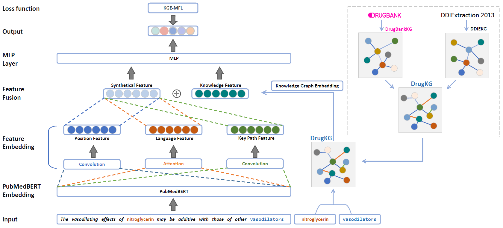

# DDIE-KGE-MFL
Source code for ["Extracting Drug-drug Interactions from Biomedical Texts using Knowledge Graph Embeddings and Multi-focal Loss"](https://doi.org/10.1145/3511808.3557318) CIKM'22.

## Implementation setup
Our project implementation depends on the following environments.
* Python == 3.7
* Pytorch == 1.9.0
* Transformers == 4.3.2
* Stanza == 1.3.0

you need to run `download_stanza.sh` to get the stanza models firstly and then to train or evaluate.  
## Train
  1. Download [PubMedBERT](https://huggingface.co/microsoft/BiomedNLP-PubMedBERT-base-uncased-abstract-fulltext)(`config.json`,`pytorch_model.bin`,`vocab.txt`) and put them to `pubmedbert` directory.
  2. Then execute `run.sh` to train the model
## Evaluation
  1. Download our pretrained model from [GoogleDrive](https://drive.google.com/file/d/1-5x35EgTLrkoK-Zc80ejfMcusBykAygD) to `pretrained` directory and decompress `model.tar.gz` or put your pretrained model into `pretrained` directory.
  2. Execute `eval.sh` to test the model on test dataset.
